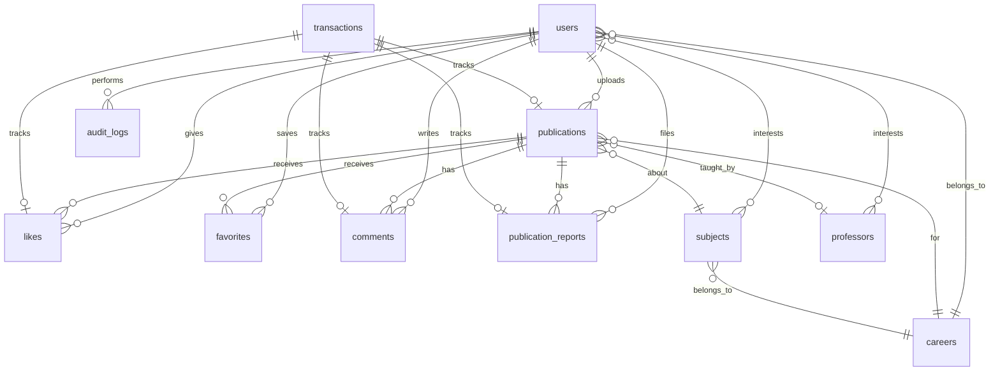

# Study Board

Plataforma web para compartir y consultar parciales académicos entre estudiantes de la Universidad Popular del Cesar (correo institucional `@unicesar.edu.co`). Incluye moderación de contenido, roles administrativos, interacción social (likes, comentarios, favoritos) y almacenamiento de archivos PDF.

---

## Tabla de contenidos

1. [Stack tecnológico](#stack-tecnológico)
2. [Arquitectura](#arquitectura)
3. [Base de datos](#base-de-datos)
4. [Servicios externos](#servicios-externos)
5. [Seguridad y autorización](#seguridad-y-autorización)
6. [Funcionalidades principales](#funcionalidades-principales)
7. [Estructura del proyecto](#estructura-del-proyecto)
8. [Configuración local](#configuración-local)
9. [Testing](#testing)
10. [Desarrollo asistido por IA](#desarrollo-asistido-por-ia)
11. [CI/CD y despliegue (GitHub Actions)](#cicd-y-despliegue-github-actions)
12. [Licencia](#licencia)

---

## Stack tecnológico

### Backend

| Tecnología | Versión | Uso |
|---|---|---|
| **PHP** | ^8.3 | Lenguaje del servidor |
| **Laravel** | ^13.8 | Framework MVC, routing, Eloquent, colas, auth |
| **Laravel Sanctum** | ^4 | Autenticación de sesión SPA |
| **Laravel Breeze** | ^2 (dev) | Scaffolding de autenticación |
| **Inertia.js (Laravel)** | ^2 | Puente server-driven SPA sin API REST separada |
| **Ziggy** | ^2 | Rutas Laravel expuestas a JavaScript |
| **Flysystem AWS S3** | ^3 | Almacenamiento de PDFs en producción |
| **PHPUnit** | ^12 | Tests automatizados |
| **Laravel Pint** | ^1 | Formateo de código PHP |
| **Laravel Boost** | ^2 (dev) | Herramientas MCP para agentes de IA |

### Frontend

| Tecnología | Versión | Uso |
|---|---|---|
| **React** | ^18 | UI componentizada |
| **TypeScript** | ^5 | Tipado estático |
| **Inertia.js (React)** | ^2 | Navegación y props desde Laravel |
| **Vite** | ^8 | Bundler y HMR |
| **Tailwind CSS** | ^3 + tokens custom | Estilo visual (tema StudySphere) |
| **Headless UI** | ^2 | Modales, transiciones accesibles |

### Infraestructura de datos y runtime

| Componente | Uso |
|---|---|
| **MySQL** | Base de datos principal (`DB_CONNECTION=mysql`) |
| **Redis** (opcional) | Cache/colas en producción |
| **Sesiones en BD** | `SESSION_DRIVER=database` |
| **Cache en BD** | `CACHE_STORE=database` |
| **Colas en BD** | `QUEUE_CONNECTION=database` |

---

## Arquitectura

El proyecto sigue un patrón **MVC extendido con capas Service/Repository**, manteniendo los controladores delgados y la lógica de negocio fuera de ellos.

```text
HTTP Request
    │
    ▼
Middleware (auth, verified, role, idempotency, throttle)
    │
    ▼
Controller ──► Form Request (validación + authorize)
    │
    ▼
Service (lógica de negocio, transacciones, idempotencia)
    │
    ├──► Repository (consultas Eloquent / agregaciones)
    │
    └──► Policy (autorización por recurso)
    │
    ▼
Inertia Response ──► React Page (resources/js/Pages)
```

### Capas

| Capa | Ubicación | Responsabilidad |
|---|---|---|
| **Controllers** | `app/Http/Controllers/` | Orquestar requests, devolver `Inertia::render()` o redirects |
| **Form Requests** | `app/Http/Requests/` | Validación de entrada y reglas de autorización |
| **Services** | `app/Services/` | Reglas de negocio, idempotencia, auditoría |
| **Repositories** | `app/Repositories/` + `app/Contracts/Repositories/` | Acceso a datos desacoplado vía interfaces |
| **Models** | `app/Models/` | Eloquent, relaciones, scopes, casts |
| **Policies** | `app/Policies/` | Permisos por modelo (`view`, `approve`, `report`, etc.) |
| **Enums** | `app/Enums/` | Estados tipados (`PublicationStatus`, `UserRole`, …) |
| **Support** | `app/Support/` | Utilidades transversales (p. ej. navegación contextual) |
| **Frontend** | `resources/js/` | Páginas Inertia, layouts, componentes React |

### Inyección de dependencias

Los repositorios se registran en `app/Providers/RepositoryServiceProvider.php`:

- `PublicationRepositoryInterface` → `PublicationRepository`
- `UserRepositoryInterface` → `UserRepository`
- `TransactionRepositoryInterface` → `TransactionRepository`
- `CareerRepositoryInterface`, `SubjectRepositoryInterface`, `ProfessorRepositoryInterface`

### Patrones transversales

- **Idempotencia**: operaciones mutables (crear publicación, like, favorito, comentario, reporte) exigen header `Idempotency-Key` (UUID) y pasan por `IdempotencyService` + tabla `transactions`.
- **Auditoría**: acciones sensibles registradas en `audit_logs` vía `AuditService`.
- **Rate limiting**: límites por acción en `AppServiceProvider` (`publication-create`, `like`, `comment`, `report`, `write-global`).
- **Soft deletes**: usuarios y publicaciones.

---

## Base de datos

Motor principal: **MySQL** (`study_center` por defecto en `.env.example`).

### Diagrama entidad-relación (simplificado)



### Tablas principales

| Tabla | Descripción |
|---|---|
| `users` | Estudiantes, maestros, admins y super admins |
| `careers` | Carreras académicas |
| `subjects` | Materias (vinculadas a carrera) |
| `professors` | Docentes |
| `publications` | Parciales PDF con metadata académica y estado de moderación |
| `likes` | Me gusta por usuario/publicación |
| `favorites` | Favoritos por usuario/publicación |
| `comments` | Comentarios anidados (respuestas) |
| `publication_reports` | Reportes de contenido |
| `transactions` | Registro idempotente de operaciones mutables |
| `audit_logs` | Trazabilidad de acciones administrativas |
| `user_subject` / `user_professor` | Intereses del estudiante para el feed |
| `configurations` | Configuración global de la aplicación |
| `sessions`, `cache`, `jobs` | Infraestructura Laravel |

### Modelos Eloquent

| Modelo | Relaciones destacadas |
|---|---|
| `User` | `publications`, `likes`, `favorites`, `comments`, `subjects`, `professors`, `career` |
| `Publication` | `user`, `subject`, `professor`, `career`, `likes`, `comments`, `reports`, `favorites` |
| `Comment` | `user`, `publication`, `replies` (auto-referencia) |
| `Like` / `Favorite` | Pivot usuario ↔ publicación |
| `PublicationReport` | `publication`, `reporter`, `reviewer` |
| `Transaction` | Entidad auditable vinculada a operaciones idempotentes |
| `AuditLog` | `actor` (usuario que ejecuta la acción) |
| `Career`, `Subject`, `Professor` | Catálogo académico |

### Enums

| Enum | Valores |
|---|---|
| `UserRole` | Student (1), Master (2), SuperAdmin (3), Admin (4) |
| `PublicationStatus` | Pending (0), Approved (1), Rejected (2) |
| `ReportStatus` | Pending, ResolvedDismissed, ResolvedHidden |
| `TransactionAction` | publication_create, like_create, favorite_create, comment_create, report_create |
| `TransactionStatus` | Estados del ciclo de vida idempotente |

---

## Servicios externos

### Amazon S3 (almacenamiento de parciales)

- **Paquete**: `league/flysystem-aws-s3-v3`
- **Configuración**: `config/publications.php`, variables `AWS_*` y `AWS_ENABLED=true`
- **Flujo producción**: el cliente solicita una URL prefirmada (`POST /publications/presigned-url`), sube el PDF directo a S3 y registra la publicación con `storage_key` + `file_url`.
- **Flujo local**: `AWS_ENABLED=false` guarda archivos en disco (`PUBLICATIONS_LOCAL_DISK=public`).

Variables relevantes:

```env
AWS_ENABLED=false
AWS_ACCESS_KEY_ID=
AWS_SECRET_ACCESS_KEY=
AWS_DEFAULT_REGION=us-east-1
AWS_BUCKET=
PUBLICATIONS_LOCAL_DISK=public
PUBLICATIONS_MAX_FILE_SIZE_KB=10240
```

### Resend (correo transaccional)

- **Estado**: integración preparada en Laravel (`config/mail.php`, `config/services.php`).
- **Uso previsto**: verificación de email, recuperación de contraseña y notificaciones.
- **Activación**:

```env
MAIL_MAILER=resend
RESEND_API_KEY=re_xxxxxxxx
MAIL_FROM_ADDRESS=noreply@tudominio.com
MAIL_FROM_NAME="Study Board"
```

> En desarrollo local el mailer por defecto es `log` (los correos se escriben en `storage/logs/laravel.log`).

### Sentry (monitoreo de errores)

- **Estado**: **próximo a implementar**.
- **Uso previsto**: captura de excepciones, performance monitoring y alertas en producción.
- **Integración planificada**: paquete `sentry/sentry-laravel`, DSN en `.env` y source maps de Vite en el pipeline de despliegue.

```env
# Próximamente
SENTRY_LARAVEL_DSN=
SENTRY_TRACES_SAMPLE_RATE=0.2
VITE_SENTRY_DSN=
```

---

## Seguridad y autorización

### Autenticación

- Laravel Breeze + Inertia React.
- Verificación de email obligatoria (`MustVerifyEmail`) para subir parciales.
- Registro restringido a correos `@unicesar.edu.co` (`App\Rules\UnicesarEmail`).

### Roles

| Rol | Capacidades |
|---|---|
| **Student** | Feed, explorar, favoritos, likes, comentarios, subir parciales |
| **Master** | Igual que estudiante + reportar publicaciones |
| **Admin** | Moderación (aprobar/rechazar/ocultar), panel de reportes |
| **Super Admin** | Todo lo anterior + gestión de usuarios, auditoría global |

Middleware `role:` (`EnsureUserHasRole`) protege rutas administrativas.

### Policies

- `PublicationPolicy` — ver, crear, aprobar, rechazar, ocultar, reportar.
- `CommentPolicy`, `PublicationReportPolicy`, `UserPolicy`.

---

## Funcionalidades principales

- **Feed personalizado** según materias y profesores de interés.
- **Búsqueda y filtros** por carrera, materia, semestre y profesor.
- **Subida de parciales** con moderación (pendiente → aprobado/rechazado).
- **Interacción**: likes, comentarios con respuestas, favoritos.
- **Reportes** de contenido y resolución por admins.
- **Paneles Admin / Super Admin** con estadísticas, pendientes, reportadas y auditoría.
- **Tema StudySphere**: UI oscura unificada (layouts, glass cards, sidebar).

---

## Estructura del proyecto

```text
study-center/
├── app/
│   ├── Contracts/Repositories/   # Interfaces de repositorios
│   ├── Enums/                    # Enums de dominio
│   ├── Http/
│   │   ├── Controllers/          # Admin/, SuperAdmin/, públicos
│   │   ├── Middleware/           # role, idempotency, Inertia
│   │   └── Requests/             # Form requests
│   ├── Models/                   # Eloquent models
│   ├── Policies/                 # Autorización
│   ├── Providers/                # Service providers
│   ├── Repositories/             # Implementaciones de repositorios
│   ├── Services/                 # Lógica de negocio
│   │   └── Storage/              # S3 / almacenamiento local
│   └── Support/                  # Helpers transversales
├── database/
│   ├── factories/                # Factories para tests
│   ├── migrations/               # Esquema de BD
│   └── seeders/                  # Datos iniciales
├── resources/
│   ├── css/app.css               # Tailwind + tokens StudySphere
│   └── js/
│       ├── Components/           # Componentes React reutilizables
│       ├── Layouts/              # StudySphereLayout, AdminLayout, …
│       └── Pages/                # Páginas Inertia
├── routes/
│   ├── web.php                   # Rutas principales
│   └── auth.php                  # Rutas de autenticación
├── tests/Feature/                # Tests de integración PHPUnit
└── public/                       # Assets compilados (Vite)
```

---

## Configuración local

### Requisitos

- PHP 8.3+
- Composer 2.x
- Node.js 20+ y npm
- MySQL 8+

### Instalación rápida

```bash
git clone <repo-url> study-center
cd study-center

composer install
cp .env.example .env
php artisan key:generate

# Configurar DB_* en .env y crear la base de datos
php artisan migrate --seed

npm install
npm run build

php artisan serve
```

O usar el script de Composer:

```bash
composer setup
```

### Desarrollo con hot reload

```bash
composer dev
```

Levanta en paralelo: servidor PHP, cola, logs (Pail) y Vite.

### Comandos útiles

```bash
php artisan test --compact          # Ejecutar tests
vendor/bin/pint --dirty             # Formatear PHP
npm run build                       # Compilar frontend
php artisan make:super-admin        # Crear super admin (comando custom)
```

---

## Testing

Suite de tests **PHPUnit** en `tests/Feature/`:

- Flujos de publicaciones, moderación, reportes, favoritos.
- Idempotencia, rate limiting, roles, storage local/S3.
- Auth, registro institucional, verificación de email.

```bash
php artisan test --compact
php artisan test --compact tests/Feature/PublicationWorkflowTest.php
```

---

## Desarrollo asistido por IA

Este proyecto fue construido y evolucionado con **desarrollo asistido por agentes de IA** en **Cursor IDE**, combinando revisión humana y pruebas automatizadas.

### Herramientas y modelos utilizados

| Herramienta / modelo | Rol en el proyecto |
|---|---|
| **Cursor IDE** | Entorno principal de edición con agentes integrados |
| **Claude (Anthropic)** | Modelo principal del agente de código en Cursor para implementación, refactors y documentación |
| **Composer (Cursor)** | Modelo alternativo de agente para tareas de codificación iterativa |
| **Laravel Boost (MCP)** | Herramientas especializadas: `search-docs`, schema de BD, rutas, logs del navegador |
| **Agent Skills** | Skills de dominio en `.claude/skills/` (Laravel best practices, Tailwind) y `laravel-inertia-react` |
| **Laravel Pint** | Formateo automático post-edición |

### Flujo de trabajo con IA

1. Definición de requisitos y plan técnico (arquitectura MVC + capas).
2. Implementación asistida por agente siguiendo `CLAUDE.md` / Laravel Boost guidelines.
3. Validación con **PHPUnit** y `npm run build` (TypeScript + Vite).
4. Revisión manual de seguridad (policies, idempotencia, rate limits).

> La IA aceleró scaffolding, UI StudySphere, capa de servicios y tests; las decisiones de arquitectura, reglas de negocio académicas y despliegue las define el equipo.

---

## CI/CD y despliegue (GitHub Actions)

El despliegue está planificado con **GitHub Actions**. A continuación, el pipeline objetivo (a implementar en `.github/workflows/`).

### Pipeline propuesto

```yaml
# .github/workflows/ci-cd.yml (referencia)
name: CI/CD Study Board

on:
  push:
    branches: [main]
  pull_request:
    branches: [main]

jobs:
  test:
    runs-on: ubuntu-latest
    services:
      mysql:
        image: mysql:8.0
        env:
          MYSQL_ROOT_PASSWORD: password
          MYSQL_DATABASE: study_center_test
        ports: ['3306:3306']
    steps:
      - uses: actions/checkout@v4
      - uses: shivammathur/setup-php@v2
        with:
          php-version: '8.3'
          extensions: mbstring, pdo_mysql
      - uses: actions/setup-node@v4
        with:
          node-version: '20'
      - run: composer install --no-interaction --prefer-dist
      - run: cp .env.example .env && php artisan key:generate
      - run: npm ci && npm run build
      - run: php artisan test --compact
      - run: vendor/bin/pint --test

  deploy:
    needs: test
    if: github.ref == 'refs/heads/main' && github.event_name == 'push'
    runs-on: ubuntu-latest
    steps:
      - uses: actions/checkout@v4
      # Build assets + deploy al servidor / Laravel Cloud / VPS
      - run: composer install --no-dev --optimize-autoloader
      - run: npm ci && npm run build
      - run: php artisan migrate --force
      - run: php artisan config:cache && php artisan route:cache && php artisan view:cache
      # rsync, SSH, Laravel Forge, Laravel Cloud u otro target
```

### Etapas del despliegue

1. **CI en cada PR/push a `main`**: tests PHPUnit, build de Vite, Pint.
2. **CD en merge a `main`**: migraciones, cache de config/rutas/vistas, publicación de assets.
3. **Secrets en GitHub** (repository settings):
   - `APP_KEY`, credenciales `DB_*`, `AWS_*`, `RESEND_API_KEY`
   - `SENTRY_LARAVEL_DSN` (cuando se active Sentry)
   - Credenciales SSH o token del proveedor de hosting

### Checklist de producción

- [ ] `APP_ENV=production`, `APP_DEBUG=false`
- [ ] `AWS_ENABLED=true` con bucket S3 privado + URLs prefirmadas
- [ ] `MAIL_MAILER=resend` con dominio verificado
- [ ] Cola y scheduler (`php artisan queue:work`, cron)
- [ ] HTTPS y `APP_URL` correcto
- [ ] Sentry conectado para alertas
- [ ] Backups de MySQL automatizados

---

## Licencia

Proyecto académico — MIT (heredado del skeleton Laravel) salvo que el equipo institucional defina otra licencia.
